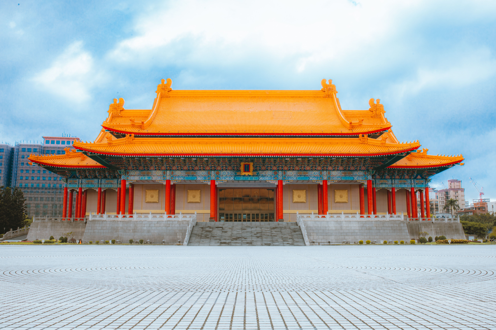
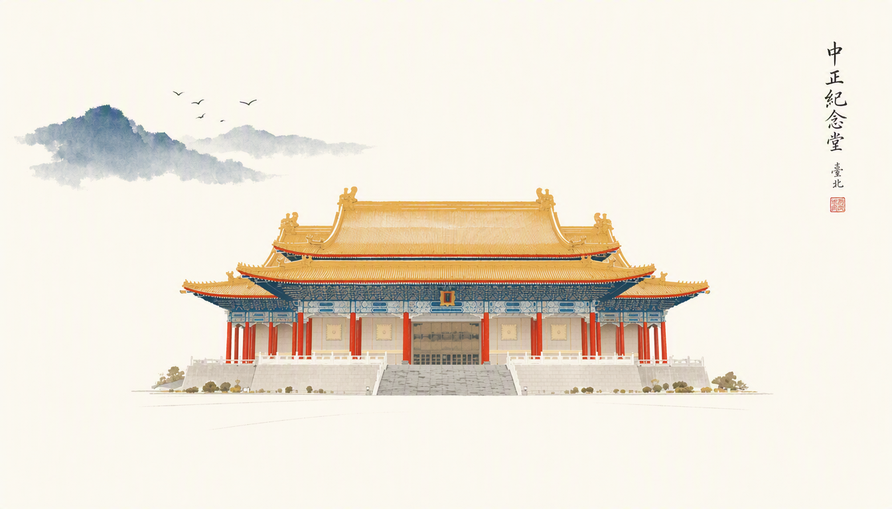
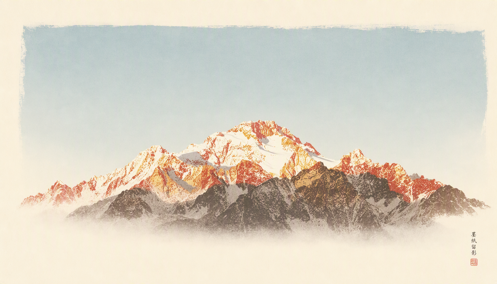
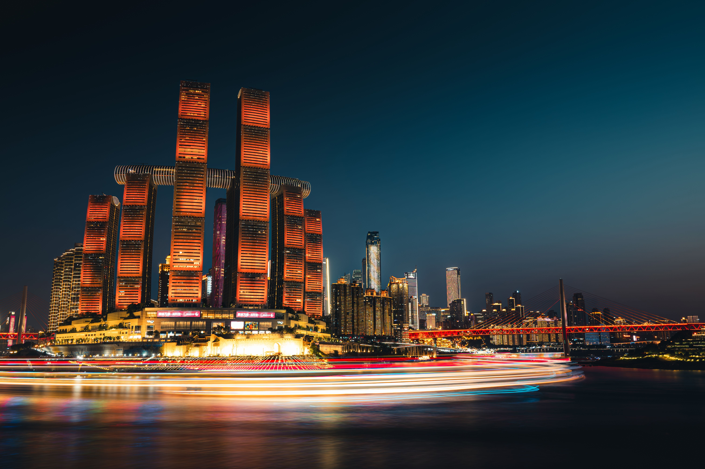
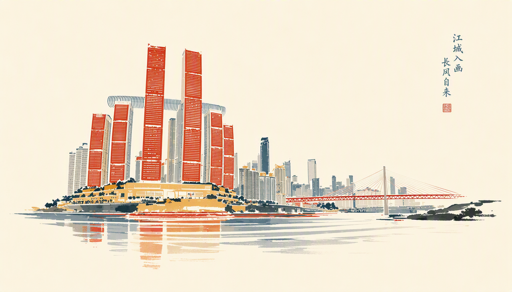
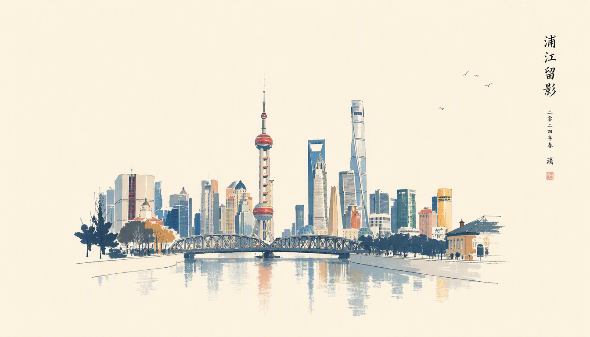

# 照片故事风格转换器 / Photo Story Style Transformer
保留原图结构，转换视觉风格，讲述不同故事。

## 简介

照片故事风格转换器是一个技能，用于将照片转换为不同的艺术风格。核心原则是：**保留原图的主要元素形状和布局，在风格、色彩、细节上进行转换**。

照片是骨架，风格是血肉。此技能让同一张照片穿越不同的视觉材质——褪色的老照片、颤抖的铅笔线、流动的水彩、留白的白描——每种风格都讲述着不同的故事。

## 核心理念

- **保持**：元素位置、构图布局、主体轮廓、空间关系
- **转换**：色彩系统、质感细节、线条风格、边缘处理

## 支持的风格

### 默认推荐
| 风格 | 特征 | 故事感 |
|-----|------|-------|
| **东方故事** | 暖象牙白纸张底色 + 原图特征性色彩调整为东方美学色调 + 大量留白 | 东方克制美学、诗意意境、留白之美 |

**重要说明**：
- 东方故事风格：基于参考图生成简化版画风格的印记图像
- 保留原图特征性色彩，调整为东方美学色调（朱砂红、石青蓝、赭石褐、藤黄等）
- 不是银盐相纸、复古摄影、手工上色风格

## 风格对比示例

### 纪念堂 / Memorial Hall

| 原图 | 东方故事风格 |
|------|-------------|
|  |  |

### 山景 / Mountain

| 原图 | 东方故事风格 |
|------|-------------|
|  |  |

### 来福士 / Raffles

| 原图 | 东方故事风格 |
|------|-------------|
|  |  |

### 上海天际线 / Shanghai Skyline

| 原图 | 东方故事风格 |
|------|-------------|
|  |  |

### 时间质感
| 风格 | 特征 | 故事感 |
|-----|------|-------|
| 老照片 | 褪色、泛黄、颗粒、磨损 | 记忆、怀旧、时间流逝 |
| 泛黄信纸 | 米黄底、褪色墨水、纸张纹理 | 私密、日常珍藏 |
| 报纸印刷 | 点阵、半色调、新闻纸 | 历史记录、大众记忆 |

### 绘画质感
| 风格 | 特征 | 故事感 |
|-----|------|-------|
| 铅笔画 | 石墨线条、纸张底纹、轻重变化 | 私密、观察者视角 |
| 炭笔画 | 深黑线条、粗犷、强烈对比 | 戏剧性、力量感 |
| 钢笔画 | 均匀墨线、交叉阴影 | 理性、经典插画 |
| 白描画 | 简洁线条、大量留白、无阴影 | 东方、禅意、留白之美 |
| 水彩画 | 流动色彩、透明叠加、水渍边缘 | 梦幻、诗意、转瞬即逝 |
| 油画 | 厚重笔触、颜料堆积、画布纹理 | 经典、艺术价值 |

### 印刷质感
| 风格 | 特征 | 故事感 |
|-----|------|-------|
| 木刻版画 | 粗犷线条、黑白对比、刀痕 | 质朴、力量、民间艺术 |
| 丝网印刷 | 色块平涂、边缘清晰 | 波普艺术、大众文化 |
| 浮世绘 | 平面装饰、轮廓线、木版纹理 | 东方古典、装饰美学 |

### 材质质感
| 风格 | 特征 | 故事感 |
|-----|------|-------|
| 沙画 | 散点构成、流动感、无明确边界 | 转瞬即逝、无常 |
| 剪纸 | 剪影效果、镂空纹样 | 民间艺术、节日、童趣 |
| 刺绣 | 绣线纹理、针脚痕迹 | 手工、匠心、传承 |
| 马赛克 | 方块拼接、色块组合 | 古典、永恒、碎片记忆 |

### 数字质感
| 风格 | 特征 | 故事感 |
|-----|------|-------|
| 像素艺术 | 可见像素块、低分辨率 | 复古游戏、数字记忆 |
| 故障艺术 | 信号干扰、色彩偏移、撕裂 | 数字故障、未来感 |
| 故障老照片 | 褪色 + RGB偏移混合 | 记忆损坏、时间侵蚀 |

### 自然质感
| 风格 | 特征 | 故事感 |
|-----|------|-------|
| 树叶拼贴 | 树叶形状拼贴 | 自然、季节、手工 |
| 光影投影 | 光线穿透形成投影 | 虚实、时间、空间 |

## 风格选择指南

### 按照片类型
- 人物肖像 → 老照片、铅笔画、白描、水彩
- 建筑风景 → 白描、木刻、钢笔画、铅笔画
- 街景纪实 → 老照片、报纸印刷、铅笔速写
- 自然风景 → 水彩、沙画、树叶拼贴
- 静物器物 → 白描、铅笔、刺绣、油画

### 按期望情绪
- 怀旧记忆 → 老照片、泛黄信纸、报纸印刷
- 安静禅意 → 白描、水墨、铅笔画
- 艺术质感 → 油画、水彩、木刻版画
- 童趣手工 → 剪纸、指画、树叶拼贴
- 现代先锋 → 故障艺术、像素艺术、丝网印刷

## 安装

把整个 `photo-story` 文件夹复制到你的 Codex skills 目录。

Windows PowerShell:

```powershell
Copy-Item -Recurse .\photo-story $env:USERPROFILE\.codex\skills\
```

macOS / Linux:

```bash
cp -R ./photo-story ~/.codex/skills/
```

重启 Codex（如果安装后没有立刻出现）。

## 使用方法

### 基础用法（默认风格）

```text
使用 $photo-story 将这张照片转换为东方故事风格。
```

### 指定其他风格

```text
使用 $photo-story 将这张照片转换为老照片风格。
```

### 指定风格

```text
使用 $photo-story，用白描画风格呈现这张建筑照片。
```

```text
使用 $photo-story，做成铅笔画的感觉，保留原图的构图。
```

### 探索风格

```text
使用 $photo-story，尝试沙画风格，我想看到转瞬即逝的美感。
```

```text
使用 $photo-story，用木刻版画的风格，要有力量感。
```

## 输出说明

### 有文生图工具可用时

**必须操作**：将用户提供的原图作为参考图传入文生图工具

生成图像后附带：
- 使用的风格名称
- 保持的原图元素说明
- 风格特征描述
- 简短的故事感说明

### 无文生图工具时

输出完整提示词，用户可手动使用：
- 主要提示词（可直接使用）
- 风格技术参数
- **注明：需将原图作为参考图使用**
- 故事感说明

## 许可证

MIT 许可证。可将此技能用于原创照片、已授权照片或有权限使用的图像。

---

结构是骨架，风格是灵魂。每一种风格转换，都是一次重新讲故事的机会。
